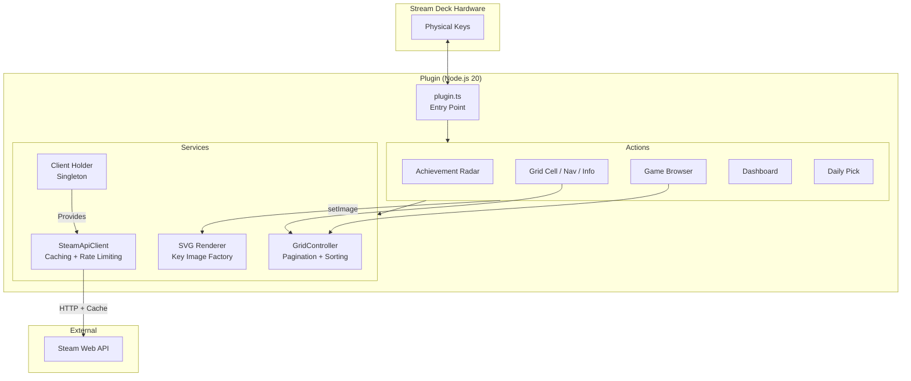

<p align="center">
  
  
  
  
  
</p>

# Steam Achievement Hunter

Track Steam achievements in real-time on your Elgato Stream Deck. Auto-detect running games, monitor unlock progress, browse achievement galleries, and celebrate new unlocks — all without leaving your game.

---

## Features

| Action | Description |
|--------|-------------|
| **Achievement Radar** | Auto-detects running Steam games, shows the next locked achievement with icon and progress. Configurable poll interval (10-600s). Press to open a YouTube/Steam guide. |
| **Achievement Grid** | Multi-key gallery spanning an entire Stream Deck page with pagination. Browse all achievements for any game at a glance. |
| **Game Browser** | Pick a game from your library or auto-detect the running one, then loads it into the grid with auto profile switching. |
| **Dashboard** | Three dedicated keys: Steam Level, Total Achievements, and Perfect Games count. |
| **Daily Pick** | Suggests one random locked achievement each day using a deterministic hash. |
| **Grid Info & Sort** | Progress ring display. Press to cycle sort modes: Default, Rarest First, Alphabetical, Locked Only, Unlocked Only. |

### Rarity System

Achievements are color-coded by global unlock percentage:

| Rarity | Unlock % | Color |
|--------|----------|-------|
| **Legendary** | < 1% |  Gold |
| **Ultra Rare** | 1 – 5% |  Purple |
| **Rare** | 5 – 20% |  Blue |
| **Uncommon** | 20 – 50% |  Green |
| **Common** | > 50% |  Gray |

### Unlock Celebration

When an achievement is unlocked while the Radar is tracking it, a **10-second golden glow animation** plays on the key with the unlocked icon.

---

## Architecture



---

## Project Structure

```
Streamdeck-Steam-Achievements/
├── src/
│   ├── plugin.ts                      # Entry point — registers actions, starts game watcher
│   ├── actions/
│   │   ├── achievement-radar.ts       # Auto-detect game, show next locked achievement
│   │   ├── daily-pick.ts             # Deterministic daily random achievement
│   │   ├── dashboard.ts              # Level, Total Achievements, Perfect Games
│   │   ├── game-browser.ts           # Game picker with auto-detect + profile switch
│   │   ├── grid-cell.ts              # Individual achievement tile in the grid
│   │   ├── grid-info.ts              # Progress ring + sort mode cycling
│   │   └── grid-nav.ts              # Prev / Next / Back navigation
│   ├── services/
│   │   ├── steam-api.ts              # Steam Web API client with caching
│   │   ├── steam-client-holder.ts    # Global singleton for SteamApiClient
│   │   ├── grid-controller.ts        # Grid state: pagination, sorting, broadcasting
│   │   └── svg-renderer.ts           # SVG image generators for all key displays
│   ├── simulator/
│   │   └── simulate.ts               # Terminal-based radar scenario simulator
│   └── __tests__/
│       ├── achievement-radar.test.ts  # Radar lifecycle, celebration, guide button
│       ├── grid-controller.test.ts    # Pagination, sorting, stats, loadGame
│       └── svg-renderer.test.ts       # Rarity info, all SVG render functions
├── scripts/
│   ├── generate-icons.ts             # Pure Node.js PNG rasterizer for all plugin icons
│   ├── gen-profiles.mjs              # Generates .streamDeckProfile ZIP bundles
│   └── bump-version.mjs             # Syncs version across package.json + manifest.json
├── com.maxik.steam-achievements.sdPlugin/
│   ├── manifest.json                 # Stream Deck SDK v2 plugin manifest
│   ├── bin/                          # Build output (gitignored)
│   ├── imgs/                         # Generated PNG icons (1x + @2x)
│   ├── profiles/                     # Generated .streamDeckProfile bundles
│   └── ui/                           # Property Inspector HTML files
├── .github/
│   ├── workflows/
│   │   ├── ci.yml                    # Lint + Test + Build on push/PR
│   │   └── release.yml               # Auto-package + GitHub Release on tags
│   ├── ISSUE_TEMPLATE/
│   │   ├── bug_report.yml
│   │   └── feature_request.yml
│   └── pull_request_template.md
├── package.json
├── tsconfig.json
├── rollup.config.mjs
├── vitest.config.ts
├── .editorconfig
├── CONTRIBUTING.md
└── CHANGELOG.md
```

---

## Getting Started

### Prerequisites

- [Node.js 20+](https://nodejs.org/)
- [Elgato Stream Deck Software 6.6+](https://www.elgato.com/downloads)
- [Steam Web API Key](https://steamcommunity.com/dev/apikey)
- Your [Steam ID (64-bit)](https://steamid.io/)

### Installation (from release)

1. Download the latest `.streamDeckPlugin` file from [Releases](https://github.com/SantosMaxime/Streamdeck-Steam-Achievements/releases)
2. Double-click the file to install it into Stream Deck
3. Add any action to your Stream Deck and configure your API Key + Steam ID in the global settings

### Development Setup

```bash
# Clone the repository
git clone https://github.com/SantosMaxime/Streamdeck-Steam-Achievements.git
cd Streamdeck-Steam-Achievements

# Install dependencies
npm install

# Register plugin with Stream Deck (one-time, required!)
# This makes the plugin visible in Stream Deck software
streamdeck link com.maxik.steam-achievements.sdPlugin

# Then close and reopen Stream Deck software completely
# The plugin should now appear in the sidebar
```

Once registered, you can start development:

```bash
# Run tests
npm test

# Build the plugin
npm run build

# Watch mode (auto-rebuilds + restarts Stream Deck plugin on file changes)
npm run watch

# In another terminal, run the terminal-based radar simulator
npm run simulate
```

**⚠️ Important:** The `streamdeck link` command is **required once** before the plugin will appear in Stream Deck. Without it, the plugin exists only in your source code but isn't visible to the app.

**If the plugin is already installed:**
- If you see `✖️ Plugin already installed: com.maxik.steam-achievements`, first unlink the old version:
  ```bash
  streamdeck unlink com.maxik.steam-achievements
  streamdeck link com.maxik.steam-achievements.sdPlugin
  ```
- Or if the plugin is already showing in Stream Deck, just run `npm run watch` directly — it will restart the already-registered plugin automatically.

### Available Scripts

| Script | Description |
|--------|-------------|
| `npm run build` | Bundle TypeScript into `sdPlugin/bin/plugin.js` via Rollup |
| `npm run watch` | Dev mode with auto-rebuild and Stream Deck restart |
| `npm test` | Run Vitest test suite |
| `npm run test:watch` | Run tests in watch mode |
| `npm run simulate` | Launch terminal-based radar simulator |
| `npm run gen-icons` | Regenerate all PNG icons via software rasterizer |
| `npm run gen-profiles` | Regenerate `.streamDeckProfile` bundles |
| `npm run package` | Full release pipeline: icons + profiles + build + pack |
| `npm run bump <patch\|minor\|major>` | Bump version in package.json + manifest.json, update CHANGELOG, commit |

### Stream Deck CLI Commands

| Command | Description |
|---------|-------------|
| `streamdeck link com.maxik.steam-achievements.sdPlugin` | **[Required]** Register the plugin with Stream Deck (one-time) |
| `streamdeck restart com.maxik.steam-achievements` | Restart the plugin (used by `npm run watch`) |
| `streamdeck stop com.maxik.steam-achievements` | Stop the plugin |
| `streamdeck unlink com.maxik.steam-achievements` | Unregister the plugin from Stream Deck |
| `streamdeck list` | List all installed plugins |
| `streamdeck validate com.maxik.steam-achievements.sdPlugin` | Validate plugin structure and manifest |

---

## Versioning

This project uses [Semantic Versioning](https://semver.org/). Versions are tracked in two files:

- `package.json` — Standard 3-part semver (`X.Y.Z`)
- `manifest.json` — Stream Deck 4-part version (`X.Y.Z.0`)

Use the bump script to keep them in sync:

```bash
# Patch release (0.1.1 → 0.1.2)
npm run bump patch

# Minor release (0.1.2 → 0.2.0)
npm run bump minor

# Major release (0.2.0 → 1.0.0)
npm run bump major
```

The script updates both files, appends a blank entry to `CHANGELOG.md`, and creates a `release:` commit on `dev`. Open a PR to `main` — CI will create the git tag and publish the GitHub Release automatically on merge.

---

## CI/CD

| Workflow | Trigger | What it does |
|----------|---------|--------------|
| **CI** | Push/PR to `main` or `dev` | Type-check, test, build |
| **Release** | Push tag `v*` | Test, build, pack `.streamDeckPlugin`, create GitHub Release with artifact |

---

## Contributing

See [CONTRIBUTING.md](CONTRIBUTING.md) for development workflow, coding conventions, and PR guidelines.

---

## Tech Stack

| Layer | Technology |
|-------|------------|
| Language | TypeScript 5.7 |
| Runtime | Node.js 20 (embedded by Stream Deck) |
| SDK | `@elgato/streamdeck` v2 |
| Bundler | Rollup 4 (TypeScript, node-resolve, commonjs, terser) |
| Testing | Vitest 4 |
| Module System | ESM |
| Image Generation | Custom SVG renderer (runtime) + custom PNG rasterizer (build-time) |
| CI/CD | GitHub Actions |

---

## License

This project is licensed under the MIT License — see [LICENSE](LICENSE) for details.
